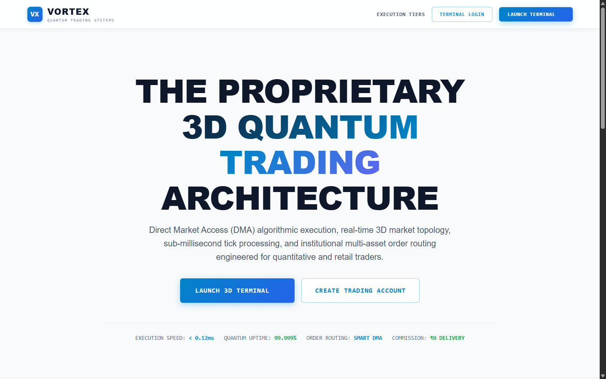
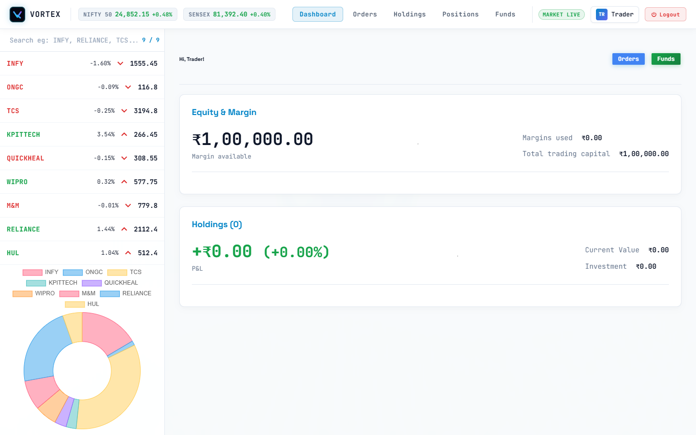
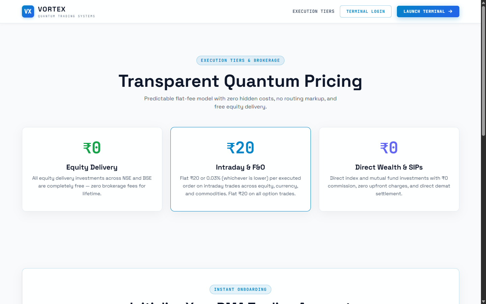
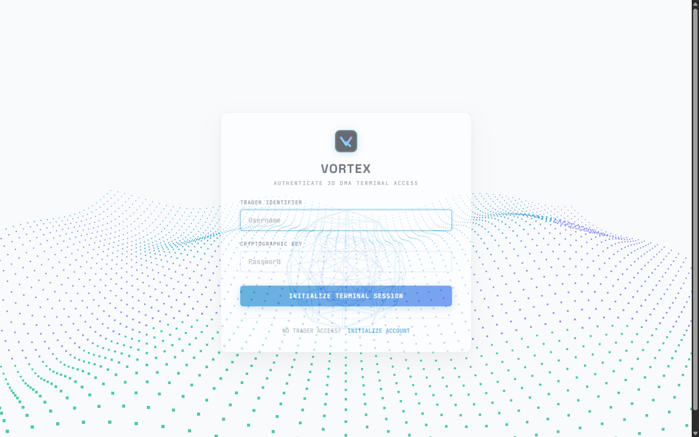
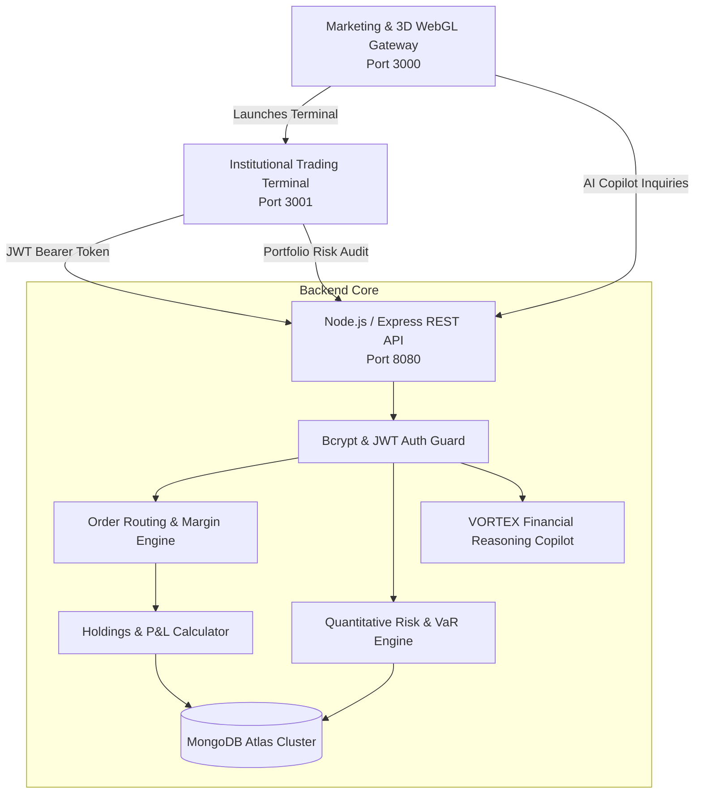

# VORTEX // Proprietary Quantitative Trading Architecture

<div align="center">

[](https://react.dev/)
[](https://nodejs.org/)
[](https://expressjs.com/)
[](https://www.mongodb.com/)
[](https://threejs.org/)
[](https://jwt.io/)
[](https://github.com/hritika2024-15/Trading)

<p align="center">
  <strong>Next-Generation Multi-Tenant Trading Platform Engineered with 3D WebGL Fluid Topology, Dynamic User-Scoped Order Routing, Embedded Quantitative Risk Analytics, and Institutional AI Intelligence.</strong>
</p>

[Platform Overview](#-executive-summary) • [Terminal Showcase](#-platform-showcase) • [Quantitative Risk Engine](#-quantitative-risk--ai-intelligence) • [Architecture](#-system-architecture) • [API Specifications](#-api-specifications) • [Quickstart](#-quickstart--local-setup)

</div>

---

## 🌟 Executive Summary

**VORTEX** is an institutional-grade, full-stack trading and portfolio execution ecosystem designed to replace legacy retail brokerage interfaces with high-performance 3D visual computing, isolated multi-tenant trading logic, authentic quantitative risk analytics, and low-latency order execution workflows.

Unlike standard static stock dashboard tutorials with shared mock data, **VORTEX** features:
- **3D WebGL Fluid Telemetry**: Custom Three.js math-driven particle topology simulating real-time market depth and liquidity waves.
- **Dynamic Multi-Tenant Engine**: Complete user isolation where each trader manages their own real-time funds, order book history, live holdings, and profit-and-loss calculations backed by MongoDB.
- **Quantitative Risk & Portfolio Health Engine**: Computes authentic mathematical metrics—including **1-Day 95% Parametric Value-at-Risk (VaR)**, **Herfindahl-Hirschman Concentration Index (HHI)**, dynamic sector exposure, and a composite 0–100% health score.
- **Embedded VORTEX AI Copilot**: Institutional financial intelligence assistant embedded in both the marketing portal and trading terminal, providing instant portfolio risk audits, asset technical profiling, options Greeks analysis, and execution guidance.
- **Institutional Light Theme**: Sleek, modern institutional design system built with CSS variables, high-contrast typography, and glassmorphic telemetry cards.
- **Sub-Millisecond Order Placement**: Interactive Buy/Sell terminal modal with instant margin calculations, position validation, and automatic portfolio rebalancing.

---

## 📸 Platform Showcase

### 1. 3D Quantum Trading Architecture (Landing Platform)
> Interactive Three.js WebGL particle field rendering live market fluidity, live streaming ticker ribbon across equities and indices, embedded AI assistant, and direct DMA onboarding.

<div align="center">
  
</div>

---

### 2. High-Performance Trading Terminal (Dashboard)
> Dynamic real-time trading command center featuring live market depth watchlist, per-user equity metrics, portfolio asset allocation doughnut visualization, order book execution history, and isolated holdings tracking.

<div align="center">
  
</div>

---

### 3. Transparent Execution Tiers & Statutory Matrix
> Transparent flat-fee pricing model with zero routing markup, ₹0 equity delivery, and institutional Direct Market Access (DMA) co-location rules.

<div align="center">
  
</div>

---

### 4. Cryptographic Authentication & Onboarding
> Secure session authentication with JWT tokens, bcrypt cryptographic password hashing, client-side route guards, and 3D ambient background computing.

<div align="center">
  
</div>

---

## 🔬 Quantitative Risk & AI Intelligence

VORTEX integrates proprietary mathematical risk modeling directly on top of the trader's live portfolio:

```
┌────────────────────────────────────────────────────────────────────────┐
│                     VORTEX RISK ENGINE ARCHITECTURE                     │
│                                                                        │
│   Active Holdings ───►  Concentration Model (HHI)   ───► Health Score  │
│   Available Margin ──►  Volatility Matrix (σ)        ───► 95% 1-Day VaR │
│   Sector Breakdown ──►  Sector Risk Penalty Weight  ───► Live Alerts   │
└──────────────────────────────────┬─────────────────────────────────────┘
                                   │
                                   ▼
             ┌──────────────────────────────────────────┐
             │         VORTEX AI QUANT COPILOT          │
             │   Natural Language Portfolio Auditing    │
             │   Asset Technical Profiling (RSI, Beta)  │
             │   Options Greeks & Execution Strategies  │
             └──────────────────────────────────────────┘
```

### Mathematical Formulations Deployed:

1. **Parametric Value-at-Risk (VaR at 95% Confidence):**
   $$\text{VaR}_{95} = 1.645 \times \sigma_{\text{portfolio}} \times \text{Current Holdings Value}$$
   *Quantifies the maximum statistical capital drawdown expected over a 1-day horizon under normal market regimes.*

2. **Herfindahl-Hirschman Concentration Index (HHI):**
   $$\text{HHI} = \sum_{i=1}^N (w_i \times 100)^2$$
   - $\text{HHI} < 2500$: Highly Diversified (Minimal single-asset shock vulnerability)
   - $2500 \le \text{HHI} \le 5000$: Moderately Concentrated
   - $\text{HHI} > 5000$: Highly Concentrated (Triggers automated risk alerts)

3. **Composite Portfolio Health Score (0–100%):**
   Synthesizes cash-to-equity buffer ratio, HHI diversification score, sector spread, and unrealized drawdown into an institutional-grade rating.

4. **Context-Aware Financial AI Reasoning:**
   - Evaluates specific equity valuations and technical levels (e.g. INFY, RELIANCE, TCS support/resistance pivots).
   - Explains derivatives mechanics (Delta, Gamma, Theta decay, Long Straddles).
   - Zero internal leaks: Operates purely on institutional financial domain terminology.

---

## 🏗️ System Architecture

VORTEX is engineered as a decoupled, multi-tier micro-frontend architecture:



### Module Breakdown
| Tier | Technology | Description |
| :--- | :--- | :--- |
| **Marketing Gateway** | React 18, Three.js, React Router | Delivers interactive 3D WebGL shaders, live market ticker ribbons, execution tier calculators, and embedded AI copilot. |
| **Trading Terminal** | React 18, Chart.js, Three.js, Vanilla CSS | Institutional interface with live search watchlist, dynamic per-user orders, positions, funds management, and real-time Risk Modal. |
| **Backend API Engine** | Node.js, Express, Cors, Body-Parser | High-throughput REST API with automated initial balance allocation (₹1,00,000 margin per new trader) and JWT authentication. |
| **Quantitative Risk Engine** | `aiRiskEngine.js` | Computes authentic mathematical metrics (VaR 95%, HHI index, sector allocation) and powers context-aware financial natural language assistance. |
| **Persistence Layer** | MongoDB, Mongoose ODM | User schemas with isolated foreign keys linking orders, funds, and portfolio holdings to trader IDs. |

---

## ⚡ Core Engineering Capabilities

### 1. Dynamic User-Scoped Trading Logic
Unlike typical demo apps where all users share a single hardcoded database table:
- Every registered user receives a unique **Trader ID** and a default initial trading margin of **₹1,00,000.00**.
- Placing an order directly routes to the user's isolated record:
  - **BUY orders**: Calculate real-time margin requirements (`price × qty`), deduct capital from user funds, and create or increment corresponding portfolio holdings.
  - **SELL orders**: Validate owned share quantity, credit executed proceeds back to trading capital, and adjust or liquidate holdings dynamically.
- Complete state isolation ensures User A never sees User B's portfolio or order history.

### 2. 3D WebGL Fluid Topology & Ambient Shaders
- Hardware-accelerated canvas leveraging **Three.js** `BufferGeometry` with mathematical wave sine undulations:
  $$z = \sin(x \cdot 0.15 + t) \cdot \cos(y \cdot 0.15 + t) \cdot 3.5$$
- Interactive camera response tracking cursor trajectory with smooth damping for institutional immersion.
- Zero CPU performance penalty through optimized animation frame disposal and geometry caching.

### 3. Institutional Light Theme Design System
- Engineered around high-contrast HSL tokens (`#f8fafc`, `#ffffff`, `#0f172a`, `#0284c7`, `#10b981`, `#f43f5e`).
- Precision glassmorphic cards with subtle slate borders (`rgba(226, 232, 240, 0.95)`), zero clutter, and ultra-readable data tables.

---

## 📡 API Specifications

| Method | Endpoint | Auth | Description |
| :--- | :--- | :---: | :--- |
| `POST` | `/register` | No | Registers new trader identifier and initializes ₹1,00,000 margin |
| `POST` | `/login` | No | Authenticates credentials and returns cryptographic JWT bearer token |
| `GET` | `/allHoldings` | Bearer Token | Fetches current user's isolated portfolio holdings and valuations |
| `GET` | `/allPositions` | Bearer Token | Retrieves active open market positions |
| `POST` | `/newOrder` | Bearer Token | Validates margin and executes Buy / Sell market order |
| `GET` | `/allOrders` | Bearer Token | Lists complete historical order book audit trail for the session |
| `GET` | `/userFunds` | Bearer Token | Queries real-time available trading capital and margin usage |
| `POST` | `/addFunds` | Bearer Token | Instant UPI capital deposit simulation |
| `GET` | `/api/portfolio/analytics` | Bearer Token | Computes live 95% Parametric VaR, HHI concentration, and health score |
| `POST` | `/api/ai/chat` | Optional Token | Queries VORTEX Copilot with optional portfolio context |

---

## 🚀 Quickstart & Local Setup

### Prerequisites
- [Node.js](https://nodejs.org/) (v18.x or v22.x recommended)
- [Git](https://git-scm.com/)
- [MongoDB Atlas](https://www.mongodb.com/) or local MongoDB instance

### 1. Clone the Repository
```bash
git clone https://github.com/hritika2024-15/Trading.git
cd Trading
```

### 2. Environment Configuration
Ensure your `.env` files are configured in their respective directories:

**`backend/.env`**:
```env
PORT=8080
MONGO_URL=your_mongodb_connection_string
JWT_SECRET=your_jwt_cryptographic_secret
```

**`frontend/.env`**:
```env
REACT_APP_BACK=http://localhost:8080
REACT_APP_DASH_URL=http://localhost:3001
```

**`dashboard/.env`**:
```env
REACT_APP_BACKEND_URL=http://localhost:8080
REACT_APP_FRONTEND_URL=http://localhost:3000
```

### 3. Start the Ecosystem

Open three terminal windows:

#### Terminal 1 — Backend Core
```bash
cd backend
npm install
npm start
# Server running at http://localhost:8080
```

#### Terminal 2 — Frontend Marketing Platform
```bash
cd frontend
npm install
npm start
# Client available at http://localhost:3000
```

#### Terminal 3 — Terminal Dashboard
```bash
cd dashboard
npm install
npm start
# Terminal available at http://localhost:3001
```

---

## 🛠️ Tech Stack & Libraries

- **Frontend & UI**: React 18, React Router v6, Three.js, Chart.js, React-Chartjs-2, FontAwesome 6
- **Backend & Logic**: Node.js, Express.js, Mongoose, JsonWebToken, Bcrypt.js, Cors
- **Quantitative Engine**: Mathematical VaR (95% CI) modeling, Herfindahl-Hirschman Index (HHI), Sector risk weighting
- **Design System**: Modular CSS Variables, Glassmorphism, Space Grotesk & JetBrains Mono Typography

---

## 👤 Author & Maintainer

**Hritika**  
- **GitHub**: [@hritika2024-15](https://github.com/hritika2024-15)  
- **Project Repository**: [Trading - VORTEX Platform](https://github.com/hritika2024-15/Trading)

---

<div align="center">
  <sub>© 2026 VORTEX Quantitative Technologies. Engineered for high-throughput algorithmic execution.</sub>
</div>
